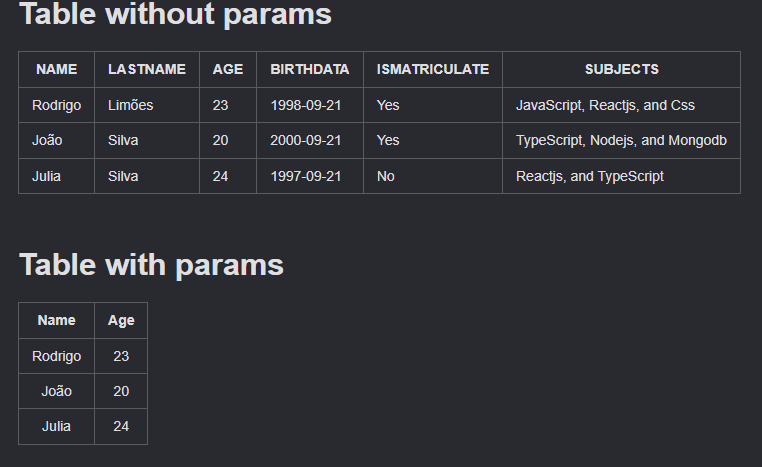

# Table without params
| NAME    | LASTNAME | AGE | BIRTHDATA  | ISMATRICULATE | SUBJECTS                        |
|:--------|:---------|:----|:-----------|:--------------|:--------------------------------|
| Rodrigo | Limões   | 23  | 1998-09-21 | Yes           | JavaScript, Reactjs, and Css    |
| João    | Silva    | 20  | 2000-09-21 | Yes           | TypeScript, Nodejs, and Mongodb |
| Julia   | Silva    | 24  | 1997-09-21 | No            | Reactjs, and TypeScript         |

# Table with params
| Name    | Age |
|:-------:|:---:|
| Rodrigo | 23  |
| João    | 20  |
| Julia   | 24  |

# CheckList with params
- [X] Text Label 2
- [ ] Text Label 2
- [X] Text Label 2

_________________
- [ ] Text Label 1
- [X] Text Label 1
- [ ] Text Label 1

_________________
- [X] Text Label 2
- [ ] Text Label 2
- [X] Text Label 2

# CheckList without params
- [X] Text Label 1
- [ ] Text Label 1
- [X] Text Label 1

# Checkbox
- [X] Label

- [ ] Label

# Link
[Rodrigo](https://github.com/rodrigolimoes)

# Image

# Image Link

